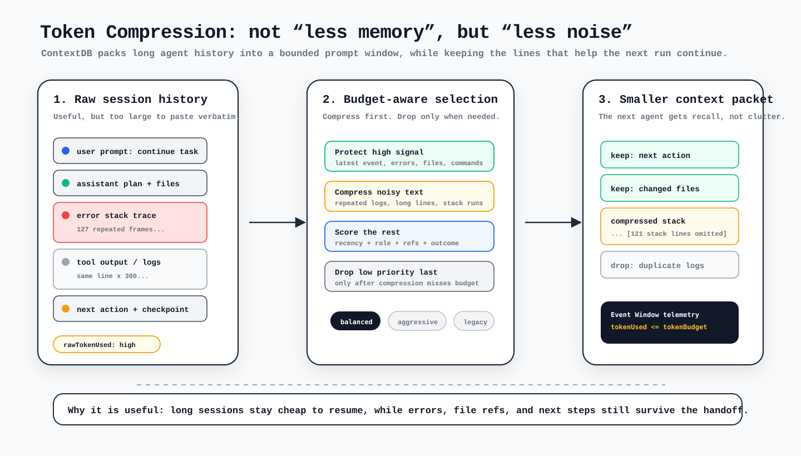

# ContextDB Token Compression: Smaller Context Packs With Safer Recall

Long-running agent sessions create useful memory, but raw history can become expensive fast. If every prompt, tool log, stack trace, and checkpoint is packed verbatim, the next agent run pays for context it may not need.

## Quick Answer

ContextDB `context:pack` now supports **token compression**. Give it a token budget and a strategy, and it will compress noisy event text before it starts dropping lower-priority events. The latest event, errors, file references, commands, and next-action signals are protected first, so the packet stays useful even when it is much smaller.

[Read the official ContextDB docs](https://cli.rexai.top/contextdb/#token-compression){ .md-button .md-button--primary }

<figure class="rex-visual">
  
  <figcaption>Wireframe version for the “what is good about compression?” question: keep signal, compress noise, fit the budget.</figcaption>
</figure>

## Do It Now

```bash
npm run contextdb -- context:pack \
  --session <id> \
  --limit 80 \
  --token-budget 1200 \
  --token-strategy balanced \
  --out memory/context-db/exports/<id>-compressed.md
```

Use `balanced` as the default. Switch to `aggressive` when you need a very small packet, or `legacy` when you want the old tail-window behavior without compression.

## What Changed

Before this upgrade, a bounded packet mostly behaved like a tail window: keep recent events until the budget is full, then stop. That is predictable, but it can throw away older high-signal context while keeping noisy recent output.

The new path is more selective:

1. Estimate the raw token cost for the candidate event window.
2. Compress repetitive logs, long line sets, and stack traces when that is safe.
3. Score events by recency, role, errors, file references, commands, and next-action signals.
4. Drop lower-priority events only if compression still cannot fit the budget.
5. Truncate the survivor only as the final fallback.

## Strategy Guide

| Strategy | Best for | Behavior |
|---|---|---|
| `balanced` | Normal daily use | Compresses noisy text while protecting latest and high-signal events. |
| `aggressive` | Very small budgets | Applies tighter line and length limits before dropping events. |
| `legacy` | Compatibility checks | Keeps the previous tail-only selection behavior and skips compression. |

The packet also includes telemetry in its `Event Window` line: `tokenBudget`, `tokenUsed`, `rawTokenUsed`, `compressed`, `dropped`, and `truncated`. That makes it easy to confirm whether the budget was met by compression or by removing events.

## Why It Matters

Token compression is most useful when you run RexCLI across multiple coding agents or long-running harness sessions. You can keep the agent aware of recent failures, changed files, and next actions without paying to replay every repeated log line.

It also pairs well with lazy load startup: interactive sessions can start fast with a small facade, then load a compressed packet only when the task needs deeper memory.

## FAQ

### Does compression replace ContextDB search?

No. Search is for retrieving specific past events. Token compression is for building the next prompt packet after the relevant session window has been selected.

### Will important errors disappear?

The default strategy protects high-signal terms, file paths, errors, and the latest event. If safety checks decide a compressed version lost too much signal, ContextDB keeps the original text for that event.

### Which command should I document in team workflows?

Use `--token-budget` with `--token-strategy balanced`. It gives teams a stable default while still allowing `aggressive` for tight budgets and `legacy` for debugging compatibility.
