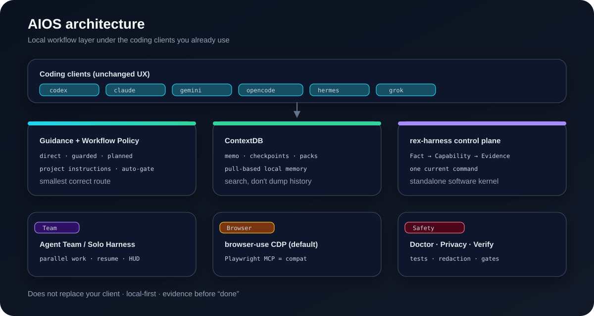
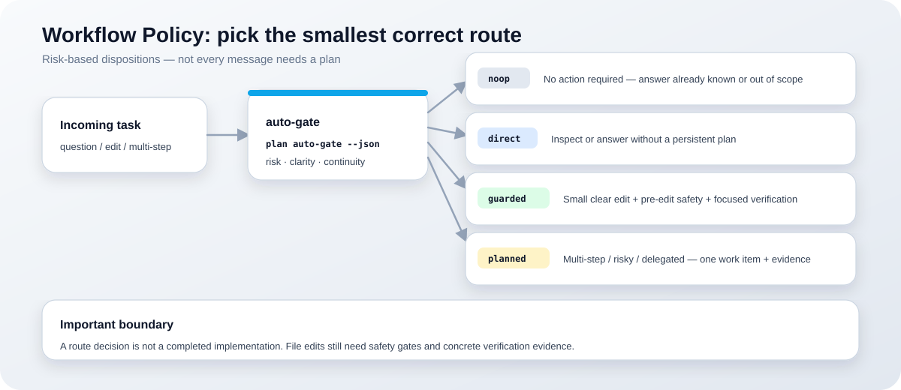
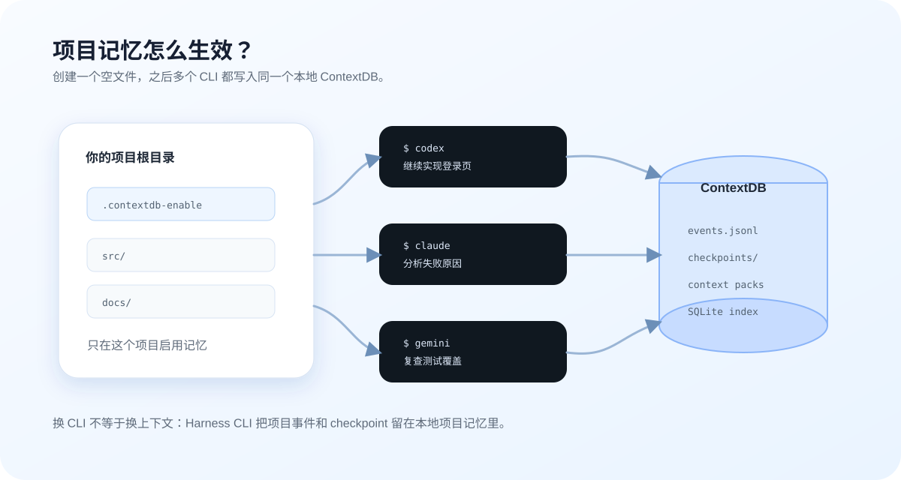

# Architecture

## Quick Answer

Harness CLI is a set of local boundaries around an existing coding client. Shell and native guidance identify the project, ContextDB stores and retrieves project evidence, Workflow Policy chooses the smallest route, and Team, Solo Harness, or Orchestrate run work when the task requires it. Browser-use CDP is the default browser path; the legacy Playwright MCP server remains a compatibility path.

## Components

| Layer | Main surface | Responsibility |
| --- | --- | --- |
| Client entry | scripts/contextdb-shell.zsh, client-sources/, native guidance | expose project instructions and route hints |
| Startup bridge | scripts/contextdb-shell-bridge.mjs, scripts/ctx-agent.mjs | decide wrapper or passthrough behavior and launch the client |
| ContextDB | mcp-server/src/contextdb/, .aios/context-db/ | persist sessions, memo, checkpoints, search data, and context packs |
| Workflow Policy | scripts/lib/planning/workflow-policy.mjs, auto-gate.mjs, cli.mjs | classify noop, direct, guarded, or planned work |
| Operations | scripts/aios.mjs, team, harness, orchestrate, HUD | dispatch work, record status, and surface evidence |
| Browser | scripts/run-browser-use-mcp.sh, chrome.*, browser.*, page.* | run browser-use MCP over CDP |
| Research | scripts/lib/rl-core/, rl-* adapters | isolated RL experiments and evaluation |

## Runtime flow

~~~text
user command
  -> supported client and native project guidance
  -> optional shell bridge / ctx-agent compatibility path
  -> .aios/context-db/index.json registry
  -> ContextDB search, memo, checkpoint, or context pack
  -> Workflow Policy route decision
  -> direct work, Team, Solo Harness, or Orchestrate
  -> diagnostics, tests, and verification evidence
~~~

A route decision is not a completed implementation. File edits still pass pre-edit safety and final verification gates.

## ContextDB and storage boundaries

The project registry points to local sources:

~~~text
.aios/
  context-db/
    index.json
    sessions/
    index/
    exports/
  memo/
    file/events.jsonl
    split/
~~~

The current public model is pull-based. The agent searches or recalls relevant sources instead of receiving all history automatically. Older wrapper modes and .contextdb-enable remain compatibility behavior and are not the preferred onboarding path.

## Workflow Policy boundary

Workflow Policy is risk-based:

| Disposition | Use |
| --- | --- |
| noop | no action is required |
| direct | answer or inspect without a persistent plan |
| guarded | small, clear local change with edit and verification gates |
| planned | multi-step, risky, delegated, resumable, or unclear work |

Plans can be none, reused, or newly created. Same-session acknowledgement is distinct from explicit cross-client resume. See [Workflow Policy](workflow-policy.md) for the canonical rules.

## Team, Solo Harness, and Orchestrate

- Agent Team is for independent work packages that can be owned separately. HUD, status, history, and quality categories provide operational evidence.
- Solo Harness is for one explicit long-running objective with checkpoints, stage journals, worktree support, and resume status.
- Orchestrate is for staged dispatch DAGs and quality-gated phase execution.
- dry-run is a local simulation. It confirms parsing and planned state, not that a live model provider or client route will work.
- live subagent execution is opt-in and currently uses the configured subagent runtime boundary. Inspect the current doctor and command help before enabling it.

Relevant controls:

~~~bash
aios team status --watch
aios harness status --session <session-name> --json
aios orchestrate --help
aios doctor --native --verbose
~~~

## Browser runtime

The documented default is browser-use MCP over CDP:

- launcher: scripts/run-browser-use-mcp.sh
- launch: chrome.launch_cdp
- connect: browser.connect_cdp
- page actions: page.semantic_snapshot, page.extract_text, page.goto, page.screenshot
- profile configuration: config/browser-profiles.json

Use a visible CDP browser, read semantic or targeted text first, and keep read -> act -> verify loops short. The legacy Playwright MCP in mcp-server is retained for compatibility and low-level inspection; it is not the default business-flow path.

## RL research surface

AIOS also contains isolated multi-environment RL research surfaces. They are not required for normal Harness CLI installation or documentation workflows.

### RL Training Layer (AIOS) {#rl-training-layer-aios}

The shared control plane under scripts/lib/rl-core/ tracks campaign state, checkpoint lineage, comparison results, replay lanes, teacher signals, and trainer entry points. Adapters cover shell, browser, orchestrator, and mixed experiments.

~~~bash
node scripts/rl-shell-v1.mjs benchmark-generate --count 20
node scripts/rl-shell-v1.mjs train --epochs 5
node scripts/rl-shell-v1.mjs eval
node scripts/rl-mixed-v1.mjs mixed --mixed
node scripts/rl-mixed-v1.mjs mixed-eval
~~~

Treat RL status and benchmarks as research evidence with their own environment and version scope. They do not automatically prove production client reliability or public performance claims.

## Failure boundaries

- Missing registry: run aios init --all from the intended project root.
- Stale native guidance: run aios doctor --native --verbose, then inspect a dry run before --fix.
- Missing browser auth: keep the human in the loop at the authentication wall.
- Failed live route: compare dry-run evidence with the actual provider and client status.
- Failed verification: keep the plan open and record the first failing command.

## Next steps

- [Quick Start](getting-started.md) - install and initialize.
- [Workflow Policy](workflow-policy.md) - choose the route.
- [Agent Team](team-ops.md) - coordinate independent work.
- [Solo Harness](solo-harness.md) - run a resumable objective.
- [Troubleshooting](troubleshooting.md) - recover an observable failure.
