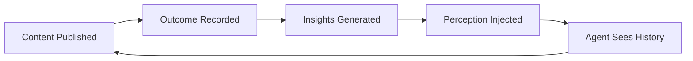

# Perception Layer

> Let your agent learn from content operation results — what worked, what didn't, and why.

The perception loop closes the gap between "agent does something" and "agent knows the result." It records structured outcome snapshots, generates statistical insights by dimension, and injects a perception summary into the agent's context so future decisions are data-informed.

## How It Works



1. **Record** — after publishing content, record metrics (likes, saves, comments, views) and context (topic, format, publish time)
2. **Analyze** — group outcomes by dimension, compute statistics, determine confidence levels
3. **Inject** — build a perception summary that the agent sees in its context on next run

## Quick Start

### Record an Outcome

```bash
aios perception record \
  --content-id "note_abc123" \
  --platform xiaohongshu \
  --content-type note \
  --title "10 AI Tools for Productivity" \
  --metrics '{"likes":150,"comments":23,"saves":45,"views":2000}' \
  --context '{"topic":"AI工具","format":"图文","publishHour":20}'
```

### Generate Insights

After recording several outcomes (minimum 3 per dimension group):

```bash
aios perception insights --min-sample 3
```

Output:

```
Generated 3 insights from 5 outcomes.
  [insight] topic=AI工具 avgLikes=123 avgSaves=53 confidence=low sampleSize=3
  [insight] format=图文 avgLikes=157 avgSaves=45 confidence=low sampleSize=4
  [insight] publishHour=20 avgLikes=123 avgSaves=53 confidence=low sampleSize=3
```

### View Perception Summary

```bash
aios perception summary
```

```bash
# JSON output for programmatic use
aios perception summary --format json
```

## Perception Summary Format

When the agent starts a new session, it sees a summary like this:

```markdown
## Perception Layer

### Performance Summary
- Content Published: 12
- Avg Engagement: 238
- Trend: improving (+18%)
- Best Recent: "10 AI Tools" (engagement=380)

### Recent Outcomes
- [24h] "10 AI Tools" likes=150 saves=45 comments=23
- [24h] "Daily Life" likes=200 saves=30 comments=45

### Active Insights
- [topic:AI工具] avgLikes=150, confidence=high (n=8)
- [format:图文] avgSaves=45, confidence=medium (n=5)
- [publishHour:20] avgEngagement=280, confidence=low (n=3)

### Strategy Recommendations
- Focus on topic "AI工具" (highest engagement)
- Prefer format "图文" (highest save rate)
- Publish around 20:00 (best time slot)
```

## Dimensions

Outcomes are grouped by these context dimensions:

| Dimension | Description | Example |
|-----------|-------------|---------|
| `topic` | Content topic/category | "AI工具", "恋爱", "情绪" |
| `format` | Content format | "图文", "视频", "vlog" |
| `publishHour` | Hour of publication (0-23) | 20 |
| `publishDayOfWeek` | Day of week | "Monday" |
| `contentType` | Content type | "note", "video" |
| `coverStyle` | Cover image style | "minimal", "illustration" |

## Confidence Levels

Insight confidence is based on sample size:

| Level | Sample Size | Meaning |
|-------|-------------|---------|
| high | n >= 8 | Reliable signal |
| medium | n >= 5 | Promising pattern |
| low | n >= 3 | Early indication |
| insufficient | n < 3 | Not enough data |

## Metrics

Standard metrics tracked:

- `likes` — post likes
- `comments` — post comments
- `saves` — post saves/bookmarks
- `shares` — post shares
- `views` — post views
- `impressions` — feed impressions
- `clickThroughRate` — CTR
- `watchTime` — video watch time
- `followerGain` — new followers from post

## Agent Context Injection

The perception summary is automatically injected into the agent's context by `ctx-agent` when building the memory prelude. This happens when:

- `CTXDB_PERCEPTION=true` (default)
- Perception data exists in the workspace

The agent sees the perception summary as part of its context, alongside persona, user profile, and workspace memo content.

## Environment Variables

| Variable | Default | Description |
|----------|---------|-------------|
| `CTXDB_PERCEPTION` | `true` | Enable/disable perception overlay |
| `PERCEPTION_MAX_CHARS` | `3000` | Max chars for perception overlay |
| `PERCEPTION_OUTCOMES_LIMIT` | `20` | Max outcomes loaded for summary |
| `PERCEPTION_INSIGHTS_LIMIT` | `10` | Max insights loaded for summary |
| `PERCEPTION_MIN_SAMPLE` | `3` | Min sample size for insight generation |

## CLI Reference

```bash
# Record outcome
aios perception record --content-id <id> --platform <name> --content-type <type> [options]

# Generate insights
aios perception insights [--min-sample <n>] [--dry-run]

# View summary
aios perception summary [--format text|json] [--max-chars <n>]
```

### Record Options

| Option | Required | Description |
|--------|----------|-------------|
| `--content-id` | Yes | Content identifier |
| `--platform` | Yes | Platform name (e.g. xiaohongshu) |
| `--content-type` | Yes | Content type (e.g. note, video) |
| `--title` | No | Content title |
| `--publish-time` | No | ISO timestamp |
| `--snapshot-window` | No | Metrics window (default: immediate) |
| `--metrics` | No | JSON metrics object |
| `--context` | No | JSON context object |
| `--json` | No | Output as JSON |

### Insights Options

| Option | Default | Description |
|--------|---------|-------------|
| `--min-sample` | 3 | Min outcomes per dimension group |
| `--dry-run` | false | Preview without storing insights |

### Summary Options

| Option | Default | Description |
|--------|---------|-------------|
| `--format` | text | Output format: text or json |
| `--max-chars` | 10000 | Max output characters |
| `--space` | default | Workspace memory space |
