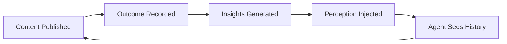

# Perception レイヤー

> **Quick Answer:** Perception は構造化されたコンテンツ結果を記録し、次の判断に必要な範囲の統計サマリーを作ります。分析とフィードバックの層であり、コンテンツの正しさや全履歴の自動注入を保証するものではありません。

## 有界なフィードバックループ

結果を記録し、十分なサンプルが集まったら insight を生成し、必要なときだけ summary を pull します。コンテキストを履歴で埋めないよう、出力サイズを制限します。

> agent にコンテンツ運用の結果から学ばせましょう——何が効いて何が効かなかったのか、そしてなぜなのか。

Perception ループは「agent が作業する」と「agent が結果を知る」のあいだの断絶を埋めます。構造化された結果スナップショットを記録し、次元ごとに統計 insight を生成し、perception summary を agent のコンテキストに注入して、これからの判断をデータに基づいたものにします。

## 仕組み



1. **記録** — 公開後に指標（いいね、保存、コメント、閲覧）とコンテキスト（トピック、形式、公開時刻）を記録します
2. **分析** — 次元ごとに結果をまとめ、統計を出し、信頼度を判定します
3. **注入** — perception summary を組み立て、次の実行時に agent がコンテキスト内で目にするようにします

## クイックスタート

### 結果を記録する

```bash
aios perception record \
  --content-id "note_abc123" \
  --platform xiaohongshu \
  --content-type note \
  --title "10 AI Tools for Productivity" \
  --metrics '{"likes":150,"comments":23,"saves":45,"views":2000}' \
  --context '{"topic":"AI工具","format":"图文","publishHour":20}'
```

### insight を生成する

いくつかの結果を記録したら（同一次元グループにつき最低 3 件）:

```bash
aios perception insights --min-sample 3
```

出力:

```
Generated 3 insights from 5 outcomes.
  [insight] topic=AI工具 avgLikes=123 avgSaves=53 confidence=low sampleSize=3
  [insight] format=图文 avgLikes=157 avgSaves=45 confidence=low sampleSize=4
  [insight] publishHour=20 avgLikes=123 avgSaves=53 confidence=low sampleSize=3
```

### perception summary を確認する

```bash
aios perception summary
```

```bash
# JSON output for programmatic use
aios perception summary --format json
```

## perception summary の形式

agent が新しいセッションを始めると、次のような summary が見えています:

```markdown
## Perception Layer

### Performance Summary
- Content Published: 12
- Avg Engagement: 238
- Trend: improving (+18%)
- Best Recent: "10 AI Tools" (engagement=380)

### Recent Outcomes
- [24h] "10 AI Tools" likes=150 saves=45 comments=23
- [24h] "Daily Life" likes=200 saves=30 comments=45

### Active Insights
- [topic:AI工具] avgLikes=150, confidence=high (n=8)
- [format:图文] avgSaves=45, confidence=medium (n=5)
- [publishHour:20] avgEngagement=280, confidence=low (n=3)

### Strategy Recommendations
- Focus on topic "AI工具" (highest engagement)
- Prefer format "图文" (highest save rate)
- Publish around 20:00 (best time slot)
```

## 分析次元

結果は次のコンテキスト次元でグループ化されます:

| 次元 | 説明 | 例 |
|-----------|-------------|---------|
| `topic` | 内容のトピック / 分類 | "AI工具", "恋爱", "情绪" |
| `format` | 内容の形式 | "图文", "视频", "vlog" |
| `publishHour` | 公開時刻（0-23） | 20 |
| `publishDayOfWeek` | 公開した曜日 | "Monday" |
| `contentType` | コンテンツ種別 | "note", "video" |
| `coverStyle` | 表紙画像のスタイル | "minimal", "illustration" |

## 信頼度

insight の信頼度はサンプル数に基づきます:

| レベル | サンプル数 | 意味 |
|-------|-------------|---------|
| high | n >= 8 | 信頼できるシグナル |
| medium | n >= 5 | 有望なパターン |
| low | n >= 3 | 初期的な兆し |
| insufficient | n < 3 | データ不足 |

## 指標

標準で追跡する指標:

- `likes` — 投稿のいいね数
- `comments` — 投稿へのコメント数
- `saves` — 投稿の保存 / ブックマーク数
- `shares` — 投稿の共有数
- `views` — 投稿の閲覧数
- `impressions` — フィードでの表示数
- `clickThroughRate` — クリック率（CTR）
- `watchTime` — 動画の視聴時間
- `followerGain` — 投稿からの新規フォロワー

## agent コンテキストへの注入

perception summary は、`ctx-agent` が memory prelude を組み立てる際に agent のコンテキストへ自動で注入されます。これは次の条件で起きます:

- `CTXDB_PERCEPTION=true`（既定）
- ワークスペースに Perception のデータが存在する

agent は perception summary を、persona・ユーザープロフィール・ワークスペースの memo と並ぶコンテキストの一部として受け取ります。

## 環境変数

| 変数 | 既定値 | 説明 |
|----------|---------|-------------|
| `CTXDB_PERCEPTION` | `true` | 知覚レイヤーの注入をオン / オフ |
| `PERCEPTION_MAX_CHARS` | `3000` | 知覚レイヤーの最大文字数 |
| `PERCEPTION_OUTCOMES_LIMIT` | `20` | summary に読み込む直近の結果件数 |
| `PERCEPTION_INSIGHTS_LIMIT` | `10` | summary に読み込む insight 数 |
| `PERCEPTION_MIN_SAMPLE` | `3` | insight 生成の最小サンプル数 |

## CLI リファレンス

```bash
# Record outcome
aios perception record --content-id <id> --platform <name> --content-type <type> [options]

# Generate insights
aios perception insights [--min-sample <n>] [--dry-run]

# View summary
aios perception summary [--format text|json] [--max-chars <n>]
```

### record のオプション

| オプション | 必須 | 説明 |
|--------|----------|-------------|
| `--content-id` | はい | コンテンツの識別子 |
| `--platform` | はい | プラットフォーム名（例：xiaohongshu） |
| `--content-type` | はい | コンテンツ種別（例：note、video） |
| `--title` | いいえ | コンテンツのタイトル |
| `--publish-time` | いいえ | ISO タイムスタンプ |
| `--snapshot-window` | いいえ | 指標の取得窓（既定：即時） |
| `--metrics` | いいえ | JSON 形式の指標オブジェクト |
| `--context` | いいえ | JSON 形式のコンテキストオブジェクト |
| `--json` | いいえ | JSON で出力 |

### insights のオプション

| オプション | 既定値 | 説明 |
|--------|---------|-------------|
| `--min-sample` | 3 | 一次元グループあたりの最小結果数 |
| `--dry-run` | false | insight を保存せずプレビューのみ |

### summary のオプション

| オプション | 既定値 | 説明 |
|--------|---------|-------------|
| `--format` | text | 出力形式：text または json |
| `--max-chars` | 10000 | 出力の最大文字数 |
| `--space` | default | ワークスペースの記憶スペース |

## よくある質問

### Perception はコンテンツを自動公開・最適化しますか？

いいえ。結果を記録して統計サマリーを作るだけです。公開、編集、外部操作には別の承認と検証が必要です。

### どれだけの履歴がタスクに入りますか？

`PERCEPTION_MAX_CHARS` などで summary の上限を設定します。pull-based のルールに従い、次の判断に必要な材料だけを読み込みます。

## 正規ドキュメント

[ContextDB](contextdb.md)、[ワークフローポリシー](workflow-policy.md)、[トラブルシューティング](troubleshooting.md)と組み合わせてください。
