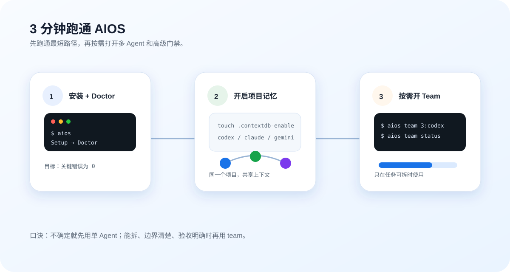

# RexCLI

> 지금 쓰는 습관은 그대로 두고, 이미 사용하는 `codex` / `claude` / `gemini` 에 기억, 협업, 검증을 더합니다.

[3분 빠른 시작](getting-started.md){ .md-button .md-button--primary data-rex-track="cta_click" data-rex-location="home_hero" data-rex-target="quick_start" }
[Agent Team 사용법](team-ops.md){ .md-button .md-button--primary data-rex-track="cta_click" data-rex-location="home_hero" data-rex-target="team_ops" }
[시나리오별 명령 찾기](use-cases.md){ .md-button data-rex-track="cta_click" data-rex-location="home_hero" data-rex-target="use_cases" }
[GitHub](https://github.com/rexleimo/rex-cli?utm_source=cli_rexai_top&utm_medium=docs&utm_campaign=ko_onboarding&utm_content=home_hero_star){ .md-button data-rex-track="cta_click" data-rex-location="home_hero" data-rex-target="github_star" }

<figure class="rex-visual">
  
  <figcaption>처음에는 가장 짧은 경로만 따라가세요. 설치 후 Doctor 를 실행하고, 프로젝트 기억을 켠 다음, 작업이 명확히 분리될 때만 Agent Team 을 사용합니다.</figcaption>
</figure>

## 핵심 기능

<div class="feature-grid">
  <a href="contextdb/" class="feature-card feature-card--memory">
    <div class="feature-card__icon">🧠</div>
    <div class="feature-card__title">ContextDB</div>
    <div class="feature-card__desc">프로젝트 전체 메모리 레이어. 이벤트, 체크포인트, 컨텍스트 패킷이 터미널 재시작 후에도 유지됩니다.</div>
    <span class="feature-card__link">더 알아보기 →</span>
  </a>
  <a href="superpowers/" class="feature-card feature-card--workflow">
    <div class="feature-card__icon">⚡</div>
    <div class="feature-card__title">Superpowers</div>
    <div class="feature-card__desc">재사용 가능한 자동화 스킬. 브레인스토밍, 계획 작성, 디버깅, 검증, 배포를 가이드된 워크플로우로 처리합니다.</div>
    <span class="feature-card__link">더 알아보기 →</span>
  </a>
  <a href="team-ops/" class="feature-card feature-card--team">
    <div class="feature-card__icon">👥</div>
    <div class="feature-card__title">Agent Team</div>
    <div class="feature-card__desc">분리 가능한 작업을 여러 CLI 워커에 분배하고 HUD로 추적합니다. 에이전트를 협력시키고 혼란은 줄입니다.</div>
    <span class="feature-card__link">더 알아보기 →</span>
  </a>
  <a href="solo-harness/" class="feature-card feature-card--tool">
    <div class="feature-card__icon">🌙</div>
    <div class="feature-card__title">솔로 Harness</div>
    <div class="feature-card__desc">실행 저널, 재개/중지 제어, worktree 격리를 갖춘 장시간 싱글 에이전트 작업.</div>
    <span class="feature-card__link">더 알아보기 →</span>
  </a>
  <a href="debug-hub/" class="feature-card feature-card--debug">
    <div class="feature-card__icon">🐛</div>
    <div class="feature-card__title">debug-hub</div>
    <div class="feature-card__desc">MCP 네이티브 디버그 로그 서비스. 코딩 에이전트가 자신의 런타임 로그를 조회하고 자가 진단할 수 있게 합니다.</div>
    <span class="feature-card__link">더 알아보기 →</span>
  </a>
  <a href="model-router/" class="feature-card feature-card--memory">
    <div class="feature-card__icon">🧭</div>
    <div class="feature-card__title">Model Router</div>
    <div class="feature-card__desc">Agent Team을 위한 지능형 모델 디스패치. 능력, 비용, 성공률에 따라 최적의 모델을 선택합니다.</div>
    <span class="feature-card__link">자세히 →</span>
  </a>
  <a href="troubleshooting/" class="feature-card feature-card--tool">
    <div class="feature-card__icon">🌐</div>
    <div class="feature-card__title">Browser MCP</div>
    <div class="feature-card__desc">CDP 기반 스텔스 브라우저 자동화. 휴먼 행동 시뮬레이션 및 탐지 방지 기능 내장.</div>
    <span class="feature-card__link">자세히 →</span>
  </a>
</div>

## 주목: debug-hub

**코딩 에이전트가 스스로 디버깅하게 하세요.** debug-hub 는 코딩 에이전트 전용으로 설계된 MCP 네이티브 디버그 로그 서비스입니다. 로그와 트레이스를 에이전트가 직접 조회할 수 있는 도구로 노출하여, 사람이 터미널 출력을 grep 하거나 오류 스팬을 수동으로 연결할 필요를 없앱니다.

| | |
|---|---|
| **agent 용 MCP 도구** | `search_logs`, `get_trace`, `list_traces`, `get_stats`, `clear_logs` |
| **3가지 SDK** | Node.js, Browser, Go — 일관된 API |
| **제로 의존성** | `~/.debug-hub/` 파일 기반 스토리지, DB 불필요, Docker 불필요 |
| **내장 Web UI** | 다크 테마 대시보드, SSE 실시간 피드 |

```bash
cd packages/debug-hub && npm install && npm run dev
# HTTP API + Web UI: http://localhost:39200, MCP 는 stdio
```

[공지 전문 읽기 →](/blog/ko/2026-05-debug-hub-mcp/){ .md-button .md-button--primary }
[빠른 시작](debug-hub.md){ .md-button }

## 먼저 하고 싶은 일을 고르세요

| 지금 하고 싶은 일 | 먼저 볼 문서 | 가장 짧은 명령 |
|---|---|---|
| 설치하고 TUI 열기 | [빠른 시작](getting-started.md) | `aios` |
| agent 가 프로젝트 맥락을 기억하게 하기 | [ContextDB](contextdb.md) | `touch .contextdb-enable && codex` |
| **agent 가 스스로 디버깅하게 하기** | **[debug-hub 블로그](/blog/ko/2026-05-debug-hub-mcp/)** | `cd packages/debug-hub && npm run dev` |
| 한 agent 를 밤새 돌리기 | [솔로 Harness](solo-harness.md) | `aios harness run --objective "내일 아침 인계 메모 정리" --worktree` |
| 여러 agent 로 함께 작업하기 | [Agent Team](team-ops.md) | `aios team 3:codex "X 구현 후 테스트 실행"` |
| 진행 상황 보기 | [HUD 가이드](hud-guide.md) | `aios team status --provider codex --watch` |
| 브라우저 자동화 진단하기 | [문제 해결](troubleshooting.md) | `aios internal browser doctor --fix` |

## RexCLI 는 무엇인가요

RexCLI 는 새로운 코딩 에이전트가 아닙니다. 로컬 우선의 기능 레이어입니다.

1. **기억 레이어 ContextDB**: 이벤트, 체크포인트, 컨텍스트 패킷을 현재 프로젝트에 저장해 터미널을 다시 열어도 이어서 작업할 수 있습니다.
2. **워크플로 레이어 Superpowers**: 요구를 계획으로 나누고, 증거 기반으로 디버깅하고, 완료 전에 검증합니다.
3. **협업 레이어 Agent Team**: 명확히 분리 가능한 작업을 여러 CLI worker 에게 맡기고 HUD 로 상태를 추적합니다.
4. **관측 레이어 debug-hub**: agent 런타임 로그와 트레이스를 MCP 도구로 노출하여 agent 가 자율적으로 오류를 진단할 수 있게 합니다.
5. **도구 레이어 Browser MCP + Privacy Guard**: agent 가 브라우저를 사용할 수 있게 하고, 민감한 설정은 공유 전에 마스킹합니다.

단일 agent 장시간 작업에는 [솔로 Harness](solo-harness.md) 가 ContextDB 위에 실행 저널, 재개/중지 제어, 선택적 worktree 격리를 더합니다.

즉, 여전히 `codex`, `claude`, `gemini` 를 실행합니다. RexCLI 는 이 도구들이 더 잘 기억하고, 더 잘 협업하고, 덜 추측하게 만듭니다.

## 새 사용자를 위한 추천 경로

### 첫날: 먼저 실행하기

```bash
curl -fsSL https://github.com/rexleimo/rex-cli/releases/latest/download/aios-install.sh | bash
source ~/.zshrc
aios
```

TUI 에서 **Setup** 을 선택한 뒤 **Doctor** 를 실행하세요.

### Step 2: 프로젝트에서 기억 켜기

```bash
cd /path/to/your/project
touch .contextdb-enable
codex
```

이후 같은 프로젝트에서 `codex` / `claude` / `gemini` 를 시작하면 RexCLI 가 같은 프로젝트 컨텍스트에 연결합니다.

### Step 3: 분리 가능한 작업에만 Agent Team 사용

```bash
aios team 3:codex "로그인 모듈을 리팩터링하고 완료 전에 관련 테스트 실행"
aios team status --provider codex --watch
```

작업이 아직 불명확하다면 일반 인터랙티브 `codex` 로 먼저 분석하세요. 명확히 나눌 수 있을 때만 `team` 을 사용합니다.

## 흔한 오해

- **모든 작업에 Agent Team 이 필요한 것은 아닙니다**: 단일 파일 수정, 작은 bug, 불명확한 요구는 단일 agent 로 시작하세요.
- **첫날 모든 환경 변수를 외울 필요는 없습니다**: 먼저 `aios` TUI 를 사용하세요.
- **기능 목록부터 보지 마세요**: "지금 무엇을 하고 싶은가"에서 명령을 고르세요.
- **Doctor 를 건너뛰지 마세요**: install, browser, skills, native 설정을 직접 바꾸기 전에 진단하세요.

## 릴리스 노트와 상세 글

- [debug-hub: MCP 네이티브 디버그 로그 서비스](/blog/ko/2026-05-debug-hub-mcp/): 코딩 에이전트가 MCP 도구로 자신의 런타임 로그를 직접 쿼리 가능.
- [AIOS RL Training System](/blog/ko/rl-training-system/): multi-environment training control plane 과 rollout model.
- [ContextDB Search Upgrade](/blog/ko/contextdb-fts-bm25-search/): FTS5 + BM25 search path 와 semantic rerank behavior.
- [Windows CLI Startup Stability](/blog/ko/windows-cli-startup-stability/): wrapper startup fix 와 Windows launch reliability.
- [Orchestrate Live](/blog/ko/orchestrate-live/): live orchestration gates 와 execution workflow.

## 다음에 읽을 문서

- [빠른 시작](getting-started.md): install, Setup, Doctor, 첫 실행.
- [시나리오별 명령 찾기](use-cases.md): 작업별 진입점 선택.
- [Agent Team](team-ops.md): 언제 team 을 쓰고, 어떻게 모니터링하고, 어떻게 마무리할지.
- [솔로 Harness](solo-harness.md): 한 agent 를 밤새 실행하고 상태 확인, 중지, 재개하는 방법.
- [ContextDB](contextdb.md): 기억이 세션을 넘어 유지되는 방식.
- [문제 해결](troubleshooting.md): install, browser, live 실행 문제.
