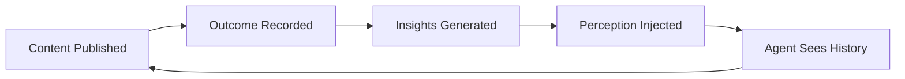

# Perception 레이어

> **Quick Answer:** Perception은 구조화된 콘텐츠 결과를 기록하고 다음 결정을 위한 범위가 제한된 통계 요약을 만듭니다. 분석·피드백 레이어이며 콘텐츠의 정확성이나 전체 이력의 자동 주입을 보장하지 않습니다.

## 경계가 있는 피드백 루프

결과를 기록하고 충분한 샘플이 쌓이면 insight를 생성하고, 필요할 때만 summary를 pull합니다. 컨텍스트가 이력으로 가득 차지 않도록 출력 크기를 제한하세요.

> agent 가 콘텐츠 운영 결과에서 배우게 하세요—무엇이 통했고, 무엇은 안 통했으며, 왜 그랬는지.

Perception 루프는 "agent 가 무언가 한다"와 "agent 가 결과를 안다" 사이의 공백을 메웁니다. 구조화된 결과 스냅샷을 기록하고, 차원별로 통계 insight 를 만들며, perception summary 를 agent 컨텍스트에 주입해 이후 판단이 데이터에 근거하도록 합니다.

## 동작 방식



1. **기록** — 게시 후 지표(좋아요, 저장, 댓글, 조회)와 컨텍스트(주제, 형식, 게시 시각)를 기록합니다
2. **분석** — 차원별로 결과를 묶고, 통계를 계산하고, 신뢰도를 판정합니다
3. **주입** — perception summary 를 만들어 다음 실행 때 agent 컨텍스트에 보이도록 합니다

## 빠른 시작

### 결과 기록하기

```bash
aios perception record \
  --content-id "note_abc123" \
  --platform xiaohongshu \
  --content-type note \
  --title "10 AI Tools for Productivity" \
  --metrics '{"likes":150,"comments":23,"saves":45,"views":2000}' \
  --context '{"topic":"AI工具","format":"图文","publishHour":20}'
```

### insight 생성하기

여러 결과를 기록한 뒤(같은 차원 그룹당 최소 3건):

```bash
aios perception insights --min-sample 3
```

출력:

```
Generated 3 insights from 5 outcomes.
  [insight] topic=AI工具 avgLikes=123 avgSaves=53 confidence=low sampleSize=3
  [insight] format=图文 avgLikes=157 avgSaves=45 confidence=low sampleSize=4
  [insight] publishHour=20 avgLikes=123 avgSaves=53 confidence=low sampleSize=3
```

### perception summary 확인하기

```bash
aios perception summary
```

```bash
# JSON output for programmatic use
aios perception summary --format json
```

## perception summary 형식

agent 가 새 세션을 시작하면 다음 같은 summary 를 보게 됩니다:

```markdown
## Perception Layer

### Performance Summary
- Content Published: 12
- Avg Engagement: 238
- Trend: improving (+18%)
- Best Recent: "10 AI Tools" (engagement=380)

### Recent Outcomes
- [24h] "10 AI Tools" likes=150 saves=45 comments=23
- [24h] "Daily Life" likes=200 saves=30 comments=45

### Active Insights
- [topic:AI工具] avgLikes=150, confidence=high (n=8)
- [format:图文] avgSaves=45, confidence=medium (n=5)
- [publishHour:20] avgEngagement=280, confidence=low (n=3)

### Strategy Recommendations
- Focus on topic "AI工具" (highest engagement)
- Prefer format "图文" (highest save rate)
- Publish around 20:00 (best time slot)
```

## 분석 차원

결과는 다음 컨텍스트 차원으로 묶입니다:

| 차원 | 설명 | 예 |
|-----------|-------------|---------|
| `topic` | 콘텐츠 주제 / 분류 | "AI工具", "恋爱", "情绪" |
| `format` | 콘텐츠 형식 | "图文", "视频", "vlog" |
| `publishHour` | 게시 시각(0-23) | 20 |
| `publishDayOfWeek` | 게시 요일 | "Monday" |
| `contentType` | 콘텐츠 유형 | "note", "video" |
| `coverStyle` | 표지 이미지 스타일 | "minimal", "illustration" |

## 신뢰도

insight 신뢰도는 표본 크기에 따라 결정됩니다:

| 단계 | 표본 수 | 의미 |
|-------|-------------|---------|
| high | n >= 8 | 신뢰할 수 있는 신호 |
| medium | n >= 5 | 가능성 있는 패턴 |
| low | n >= 3 | 초기 징후 |
| insufficient | n < 3 | 데이터 부족 |

## 지표

기본으로 추적하는 지표:

- `likes` — 게시물 좋아요 수
- `comments` — 게시물 댓글 수
- `saves` — 저장 / 북마크 수
- `shares` — 공유 수
- `views` — 조회 수
- `impressions` — 피드 노출 수
- `clickThroughRate` — 클릭률(CTR)
- `watchTime` — 영상 시청 시간
- `followerGain` — 게시물에서 유입된 신규 팔로워

## agent 컨텍스트 주입

perception summary 는 `ctx-agent` 가 memory prelude 를 구성할 때 agent 컨텍스트에 자동 주입됩니다. 다음 조건에서 발생합니다:

- `CTXDB_PERCEPTION=true`(기본값)
- 워크스페이스에 Perception 데이터가 있을 때

agent 는 perception summary 를 persona, 사용자 프로필, 워크스페이스 memo 와 나란한 컨텍스트의 일부로 받습니다.

## 환경 변수

| 변수 | 기본값 | 설명 |
|----------|---------|-------------|
| `CTXDB_PERCEPTION` | `true` | 인지 레이어 주입 켜기 / 끄기 |
| `PERCEPTION_MAX_CHARS` | `3000` | 인지 레이어 최대 문자 수 |
| `PERCEPTION_OUTCOMES_LIMIT` | `20` | summary 에 로드되는 최근 결과 수 |
| `PERCEPTION_INSIGHTS_LIMIT` | `10` | summary 에 로드되는 insight 수 |
| `PERCEPTION_MIN_SAMPLE` | `3` | insight 생성의 최소 표본 수 |

## CLI 참고

```bash
# Record outcome
aios perception record --content-id <id> --platform <name> --content-type <type> [options]

# Generate insights
aios perception insights [--min-sample <n>] [--dry-run]

# View summary
aios perception summary [--format text|json] [--max-chars <n>]
```

### record 옵션

| 옵션 | 필수 | 설명 |
|--------|----------|-------------|
| `--content-id` | 예 | 콘텐츠 식별자 |
| `--platform` | 예 | 플랫폼 이름(예: xiaohongshu) |
| `--content-type` | 예 | 콘텐츠 유형(예: note, video) |
| `--title` | 아니오 | 콘텐츠 제목 |
| `--publish-time` | 아니오 | ISO 타임스탬프 |
| `--snapshot-window` | 아니오 | 지표 수집 창(기본: 즉시) |
| `--metrics` | 아니오 | JSON 형식 지표 객체 |
| `--context` | 아니오 | JSON 형식 컨텍스트 객체 |
| `--json` | 아니오 | JSON 으로 출력 |

### insights 옵션

| 옵션 | 기본값 | 설명 |
|--------|---------|-------------|
| `--min-sample` | 3 | 차원 그룹당 최소 결과 수 |
| `--dry-run` | false | insight 를 저장하지 않고 미리 보기 |

### summary 옵션

| 옵션 | 기본값 | 설명 |
|--------|---------|-------------|
| `--format` | text | 출력 형식: text 또는 json |
| `--max-chars` | 10000 | 출력 최대 문자 수 |
| `--space` | default | 워크스페이스 기억 공간 |

## 자주 묻는 질문

### Perception이 콘텐츠를 자동 게시하거나 최적화하나요?

아닙니다. 결과를 기록하고 통계 요약을 만들 뿐입니다. 게시, 편집, 외부 작업은 별도의 승인과 검증이 필요합니다.

### 작업에 얼마나 많은 이력이 들어가나요?

`PERCEPTION_MAX_CHARS` 같은 설정으로 summary 상한을 둡니다. pull-based 규칙에 따라 다음 판단에 필요한 자료만 읽습니다.

## 공식 문서

[ContextDB](contextdb.md), [워크플로 정책](workflow-policy.md), [문제 해결](troubleshooting.md)과 함께 사용하세요.
