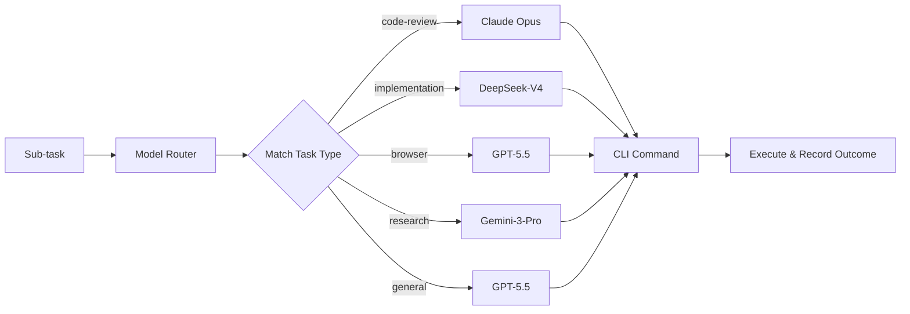

# Model Router

> Don't memorize CLI commands for each model. Teach your agent to route tasks to the right model automatically.

The Model Router is an intelligent dispatch layer for multi-model Agent Teams. It maintains a registry of model capabilities, matches sub-tasks to the best model, generates CLI commands in the correct protocol (claude/codex/gemini), and learns from dispatch history via the perception feedback loop.

## How It Works



1. **Analyze** — the agent reads the sub-task and matches it to a task type (code review, implementation, research, etc.)
2. **Route** — the Model Router selects the primary model by capability match, with a cost-ascending fallback chain
3. **Dispatch** — a CLI command is generated in the correct protocol based on model provider
4. **Learn** — dispatch outcomes are recorded to the perception layer; future routing considers historical success rates

## Agent Team Runtime

`aios team` and `aios orchestrate --dispatch local --execute live` now apply the Model Router per phase by default instead of using one outer worker client for every role.

- Phase jobs expose `launchSpec.requiresModel=true` and `launchSpec.modelRouting` with `role`, `taskType`, `modelId`, `provider`, `clientId`, `cliCommand`, `reason`, and `fallback`.
- Merge gates stay deterministic control jobs with `requiresModel=false`.
- Live subagent and GroupChat workers switch to the routed CLI client (`codex-cli`, `claude-code`, or `gemini-cli`) and append the correct model argument for that protocol.
- Worker prompts include a `## Model Router` section so the selected model/protocol is visible in prompt logs and handoffs.
- Each phase or speaker writes a ContextDB `kind=model.dispatch` event with `turn.environment=model-router`; refs include the routed model, task type, and role for `model-router stats`.

Disable execution-time CLI switching when you need a fixed worker client:

```bash
AIOS_MODEL_ROUTER=0 aios team "implement the feature"
# also accepted: false, off, no
```

Dry-runs still include planned routing metadata where safe, so previews remain auditable without invoking models.

## Model Capability Registry

The registry (`memory/specs/model-registry.json`) defines 8 models with structured capabilities:

| Model | Provider | Strengths | Cost |
|-------|----------|-----------|------|
| **Claude Opus 4.7** | claude | Code review, architecture, security audit | Highest |
| **Claude Sonnet 4.6** | claude | Daily dev, RAG, rapid prototyping | Medium |
| **GPT-5.5** | codex | All-rounder: automation, reasoning, code execution | Highest |
| **DeepSeek-V4-Pro** | claude | Algorithm, core logic, batch processing | Lowest |
| **GLM-5.1** | claude | Math reasoning, autonomous loops, planning | Low |
| **Kimi K2.6** | claude | Multi-agent orchestration, frontend UI, long execution | Low |
| **MiniMax-M2.7** | claude | Self-healing, production recovery | Low |
| **Gemini-3-Pro** | gemini | Multimodal analysis, long-doc research, 1M context | Medium |

## CLI Protocol

Three protocols, automatically selected by provider:

| Protocol | CLI | Used By |
|----------|-----|---------|
| **codex** | `codex exec --dangerously-bypass-approvals-and-sandbox -m <model> "<prompt>"` | GPT-5.5 |
| **gemini** | `gemini -m gemini-3-pro -p "<prompt>"` | Gemini-3-Pro |
| **claude** | `claude --model <model> -p "<prompt>"` | All other models |

Codex live workers use the documented `--dangerously-bypass-approvals-and-sandbox` flag (the current equivalent of the old `--yolo` shorthand) so background subagents do not wait on approval or sandbox prompts. Set `AIOS_SUBAGENT_CODEX_UNATTENDED=0` only when you intentionally want to debug Codex without that bypass.

## Routing Rules

| Task Type | Primary | Fallback Chain |
|-----------|---------|----------------|
| code-review | Claude Opus | GPT-5.5 → GLM-5.1 |
| security-review | Claude Opus | GPT-5.5 → GLM-5.1 |
| architecture | Claude Opus | GPT-5.5 → GLM-5.1 |
| implementation | DeepSeek-V4 | GPT-5.5 → Claude Sonnet |
| browser-automation | GPT-5.5 | Kimi K2.6 → Claude Sonnet |
| research | Gemini-3-Pro | GPT-5.5 → Kimi K2.6 |
| planning | GLM-5.1 | GPT-5.5 → Claude Opus |
| testing | Claude Sonnet | GPT-5.5 → DeepSeek-V4 |
| docs | Claude Sonnet | GPT-5.5 → Kimi K2.6 |
| frontend | Kimi K2.6 | GPT-5.5 → Claude Sonnet |
| self-healing | MiniMax-M2.7 | GLM-5.1 → GPT-5.5 |
| general | GPT-5.5 | Claude Sonnet → DeepSeek-V4 |

## Quick Start

### View the Model Registry

```bash
node scripts/aios.mjs model-router list
```

### Route a Task to the Best Model

```bash
# Auto-detect task type from description
node scripts/aios.mjs model-router route --task "审查 auth.js 的安全漏洞"

# Explicit task type
node scripts/aios.mjs model-router route --task "重构数据库连接" --task-type implementation
```

### View Dispatch Statistics

```bash
node scripts/aios.mjs model-router stats
```

## Environment Variable Overrides

Override model selection per role without changing config files:

```bash
export AIOS_MODEL_PLANNER=claude-opus
export AIOS_MODEL_IMPLEMENTER=deepseek-v4
export AIOS_MODEL_REVIEWER=claude-opus
export AIOS_MODEL_SECURITY_REVIEWER=claude-opus
```

Disable live execution-time CLI switching while keeping routing metadata in previews/reports:

```bash
export AIOS_MODEL_ROUTER=0
```

Or override by task type:

```bash
export AIOS_MODEL_CODE_REVIEW=claude-opus
export AIOS_MODEL_RESEARCH=gemini-3-pro
export AIOS_MODEL_GENERAL=gpt-5.5
```

## Agent Integration

### Via Task Router Guide

The Model Router is injected into the agent's context via the AIOS Task Router. Any agent running through `ctx-agent` automatically receives model routing guidance. When dispatching sub-tasks, the agent can invoke the `model-router` skill to determine the optimal model.

### Via Orchestrator

Agent Team dispatch resolves model routing from role defaults and environment overrides. The default role mapping is:

| Role | Task Type | Default Primary |
|------|-----------|-----------------|
| planner | planning | GLM-5.1 |
| implementer | implementation | DeepSeek-V4 |
| reviewer | code-review | Claude Opus |
| security-reviewer | security-review | Claude Opus |

The effective model is resolved via: **role env var** > **task-type env var** > **routing rule primary** > **fallback chain**.

Agent role cards (`.claude/agents/*.md`) may also include a `preferredModel` field for compatibility with older orchestrator flows:

```yaml
# .claude/agents/rex-reviewer.md
model: sonnet
preferredModel: claude-opus
```

In live team execution, the `launchSpec.modelRouting.clientId` decides the CLI protocol unless `AIOS_MODEL_ROUTER=0` disables execution-time override.

## Perception Feedback Loop

Every model dispatch is recorded as a `model.dispatch` event in ContextDB:

```json
{
  "kind": "model.dispatch",
  "modelId": "claude-opus",
  "taskType": "code-review",
  "success": true,
  "latencyMs": 4500,
  "costEstimate": "high"
}
```

The perception system can compute model success rates per task type. Future routing decisions can weight: **capability match × historical success rate × cost**.

## Configuration Files

| File | Purpose |
|------|---------|
| `memory/specs/model-registry.json` | Model capabilities, routing rules, CLI protocol config |
| `memory/specs/orchestrator-agents.json` | Agent role → preferredModel mapping (schema v2) |
| `.claude/skills/model-router/SKILL.md` | Agent-callable skill for self-service routing |
| `.claude/agents/*.md` | Agent role cards with preferredModel frontmatter |
| `scripts/lib/model-router.mjs` | Router logic: matching, fallback, CLI building, stats |
