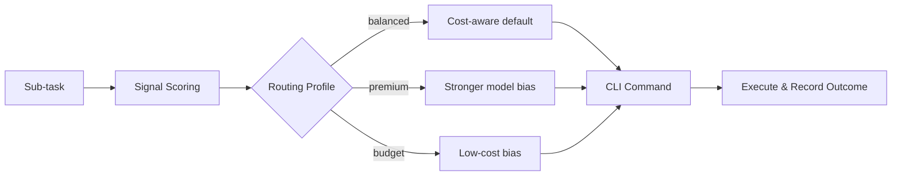

# Model Router

> Don't memorize CLI commands for each model. Teach your agent to route tasks to the right model automatically.

The Model Router is a dispatch layer for multi-model Agent Teams. It maintains a registry of model capabilities, scores task signals, selects the best model for the active routing profile, generates CLI commands in the correct protocol (claude/codex/gemini), and records dispatch history for diagnostics.

## How It Works



1. **Analyze** — scan the task for weighted signals such as browser automation, frontend UI, production incident, security review, long-document research, or ordinary implementation.
2. **Route** — select the primary model by task type, profile, and capability match, with a fallback chain.
3. **Explain** — return `profile`, `confidence`, `matchedSignals`, `why`, and `recommendedPhases` so the decision can be audited.
4. **Record** — live dispatches write `model.dispatch` events to ContextDB for stats and troubleshooting.

Dispatch history is diagnostic in v2. The router records outcomes and can report success rates, but historical success rate is not yet part of the live scoring formula.

## Balanced v2 Profiles

| Profile | Use when | Behavior |
|---------|----------|----------|
| `balanced` | Default for most work | Strong signals upgrade; ordinary implementation stays cost-aware. |
| `premium` | Broad, risky, ambiguous, or low-confidence tasks | More willing to use GPT-5.5 or Claude Opus. |
| `budget` | Cost-sensitive background work | Prefers low-cost models except for hard capability requirements. |

Use a profile per command:

```bash
node scripts/aios.mjs model-router route \
  --task "用浏览器打开小红书发布页面，上传图片并填写标题" \
  --profile balanced \
  --explain
```

Or set the default for a session:

```bash
export AIOS_MODEL_ROUTER_PROFILE=premium
```

## Signal-Based Routing

| Signal examples | Task Type | Primary Model | Why |
|-----------------|-----------|---------------|-----|
| `浏览器`, `打开`, `上传`, `填写`, `screenshot`, `computer use` | `browser-automation` | GPT-5.5 | Browser/desktop workflows need strong tool-use reasoning. |
| `安全`, `漏洞`, `注入`, `权限`, `security`, `auth` | `security-review` | Claude Opus | High-risk review benefits from the strongest reviewer. |
| `代码审查`, `review`, `pull request`, `code quality` | `code-review` | Claude Opus | Review and quality gates benefit from a strong reviewer. |
| `线上`, `故障`, `事故`, `日志`, `recover`, `production` | `self-healing` | MiniMax-M2.7 | Production recovery is a specialized operations path. |
| `架构`, `系统设计`, `cross-module`, `tech stack` | `architecture` | Claude Opus | Architectural judgment and risk evaluation matter most. |
| `很长`, `长文档`, `第三方 API`, `video`, `multimodal` | `research` | Gemini-3-Pro | Long context and multimodal recall are the key capability. |
| `frontend`, `UI`, `landing page`, `component`, `style`, `beautiful` | `frontend` | Kimi K2.6 | Frontend/UI work should not be treated as generic coding. |
| `实现`, `implement`, `develop`, ordinary endpoint work | `implementation` | DeepSeek-V4 | Cheap and strong for normal implementation. |

## Model Capability Registry

The registry (`memory/specs/model-registry.json`) defines 8 models with structured capabilities:

| Model | Provider | Strengths | Cost |
|-------|----------|-----------|------|
| **Claude Opus 4.7** | claude | Code review, architecture, security audit | Highest |
| **Claude Sonnet 4.6** | claude | Daily dev, RAG, rapid prototyping, docs | Medium |
| **GPT-5.5** | codex | All-rounder: automation, reasoning, code execution | Highest |
| **DeepSeek-V4-Pro** | claude | Algorithm, core logic, batch processing | Lowest |
| **GLM-5.1** | claude | Math reasoning, autonomous loops, planning | Low |
| **Kimi K2.6** | claude | Multi-agent orchestration, frontend UI, long execution | Low |
| **MiniMax-M2.7** | claude | Self-healing, production recovery | Low |
| **Gemini-3-Pro** | gemini | Multimodal analysis, long-doc research, 1M context | Medium |

## CLI Protocol

Three protocols are automatically selected by provider:

| Protocol | CLI | Used By |
|----------|-----|---------|
| **codex** | `codex exec --dangerously-bypass-approvals-and-sandbox -m <model> "<prompt>"` | GPT-5.5 |
| **gemini** | `gemini -m gemini-3-pro -p "<prompt>"` | Gemini-3-Pro |
| **claude** | `claude --model <model> -p "<prompt>"` | All other models |

Codex live workers use `--dangerously-bypass-approvals-and-sandbox` so background subagents do not wait on approval or sandbox prompts. Set `AIOS_SUBAGENT_CODEX_UNATTENDED=0` only when you intentionally want to debug Codex without that bypass.

## Routing Rules

| Task Type | Primary | Fallback Chain |
|-----------|---------|----------------|
| code-review | Claude Opus | GPT-5.5 -> GLM-5.1 |
| security-review | Claude Opus | GPT-5.5 -> GLM-5.1 |
| architecture | Claude Opus | GPT-5.5 -> GLM-5.1 |
| implementation | DeepSeek-V4 | GPT-5.5 -> Claude Sonnet |
| browser-automation | GPT-5.5 | Kimi K2.6 -> Claude Sonnet |
| research | Gemini-3-Pro | GPT-5.5 -> Kimi K2.6 |
| planning | GLM-5.1 | GPT-5.5 -> Claude Opus |
| testing | Claude Sonnet | GPT-5.5 -> DeepSeek-V4 |
| docs | Claude Sonnet | GPT-5.5 -> Kimi K2.6 |
| frontend | Kimi K2.6 | GPT-5.5 -> Claude Sonnet |
| self-healing | MiniMax-M2.7 | GLM-5.1 -> GPT-5.5 |
| general | GPT-5.5 | Claude Sonnet -> DeepSeek-V4 |

## Quick Start

### View the Model Registry

```bash
node scripts/aios.mjs model-router list
```

### Route a Task and Explain the Decision

```bash
node scripts/aios.mjs model-router route \
  --task "build a beautiful landing page component" \
  --profile balanced \
  --explain
```

Expected decision: `frontend -> kimi-k2.6`.

### Force an Explicit Task Type

```bash
node scripts/aios.mjs model-router route \
  --task "重构数据库连接" \
  --task-type implementation
```

### View Dispatch Statistics

```bash
node scripts/aios.mjs model-router stats
```

`stats` shows recorded live dispatch events. It helps detect patterns such as all recent work going to `deepseek-v4 / implementation`, but it does not mean the router uses those historical rates as live scoring weights yet.

## Why Was This Model Selected?

`--explain` and JSON output include fields like:

```json
{
  "resolvedType": "browser-automation",
  "modelId": "gpt-5.5",
  "profile": "balanced",
  "confidence": 0.86,
  "matchedSignals": [
    { "taskType": "browser-automation", "signal": "浏览器", "weight": 8 },
    { "taskType": "browser-automation", "signal": "上传", "weight": 8 }
  ],
  "why": [
    "Detected browser-automation signals: 浏览器, 上传, 填写",
    "balanced profile selected browser-automation"
  ],
  "recommendedPhases": [
    { "taskType": "browser-automation", "score": 24 }
  ]
}
```

Interpretation tips:

- High `confidence` means one task type clearly won.
- Several `recommendedPhases` mean the prompt is compound; split it into smaller tasks for better routing.
- `matchedSignals` is the fastest way to see if wording caused a misroute.
- `reason` still reports the underlying primary/fallback rule for compatibility.

## Agent Team Runtime

`aios team` and `aios orchestrate --dispatch local --execute live` apply the Model Router per phase by default instead of using one outer worker client for every role.

- Phase jobs expose `launchSpec.requiresModel=true` and `launchSpec.modelRouting` with `role`, `taskType`, `modelId`, `provider`, `clientId`, `cliCommand`, `reason`, `fallback`, and v2 explain fields where available.
- Merge gates stay deterministic control jobs with `requiresModel=false`.
- Live subagent and GroupChat workers switch to the routed CLI client (`codex-cli`, `claude-code`, or `gemini-cli`) and append the correct model argument for that protocol.
- Worker prompts include a `## Model Router` section so the selected model/protocol is visible in prompt logs and handoffs.
- Each phase or speaker writes a ContextDB `kind=model.dispatch` event with `turn.environment=model-router`; refs include the routed model, task type, and role for `model-router stats`.

Disable execution-time CLI switching when you need a fixed worker client:

```bash
AIOS_MODEL_ROUTER=0 aios team "implement the feature"
# also accepted: false, off, no
```

Dry-runs still include planned routing metadata where safe, so previews remain auditable without invoking models.

## Environment Variable Overrides

Override model selection per role without changing config files:

```bash
export AIOS_MODEL_PLANNER=claude-opus
export AIOS_MODEL_IMPLEMENTER=deepseek-v4
export AIOS_MODEL_REVIEWER=claude-opus
export AIOS_MODEL_SECURITY_REVIEWER=claude-opus
```

Override the routing profile:

```bash
export AIOS_MODEL_ROUTER_PROFILE=budget
```

Disable live execution-time CLI switching while keeping routing metadata in previews/reports:

```bash
export AIOS_MODEL_ROUTER=0
```

Or override by task type:

```bash
export AIOS_MODEL_BROWSER_AUTOMATION=gpt-5.5
export AIOS_MODEL_CODE_REVIEW=claude-opus
export AIOS_MODEL_RESEARCH=gemini-3-pro
export AIOS_MODEL_GENERAL=gpt-5.5
```

The effective model is resolved via: **role env var** > **task-type env var** > **routing rule primary** > **fallback chain**. Profiles affect task-type selection when the task type is inferred from text.

## Troubleshooting

### Why are my subscribed models not used?

- Run `model-router route --task "..." --profile balanced --explain` to inspect the signals.
- Ordinary implementation intentionally stays on DeepSeek under `balanced`.
- Use `--profile premium` for broad or risky tasks where you prefer stronger subscribed models.
- Add explicit task wording (`browser`, `frontend`, `security`, `architecture`, `long document`) or use `--task-type` when the task is already known.

### Why do stats show everything as DeepSeek implementation?

`model-router stats` reads historical `model.dispatch` events. If old orchestrator runs classified every phase as implementation, stats will keep showing that history until new routed runs are recorded. Use `route --explain` for the current decision, and use stats only to spot operational drift.

### Why did a compound task get one model?

The route command still returns one `resolvedType` for compatibility. Check `recommendedPhases`; if it lists multiple task types, split the work or let an orchestrator plan phases explicitly. V2 reports compound advice but does not automatically rewrite `aios team` plans.

## Configuration Files

| File | Purpose |
|------|---------|
| `memory/specs/model-registry.json` | Model capabilities, routing rules, profiles, signal rules, CLI protocol config |
| `memory/specs/orchestrator-agents.json` | Agent role -> preferredModel mapping (schema v2) |
| `.claude/skills/model-router/SKILL.md` | Agent-callable skill for self-service routing |
| `scripts/lib/model-router.mjs` | Router logic: scoring, matching, fallback, CLI building, stats |
