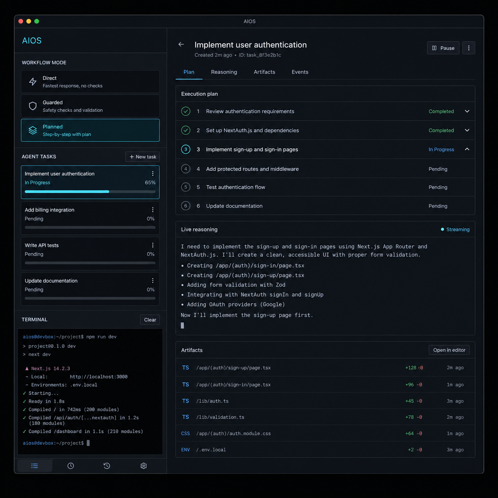
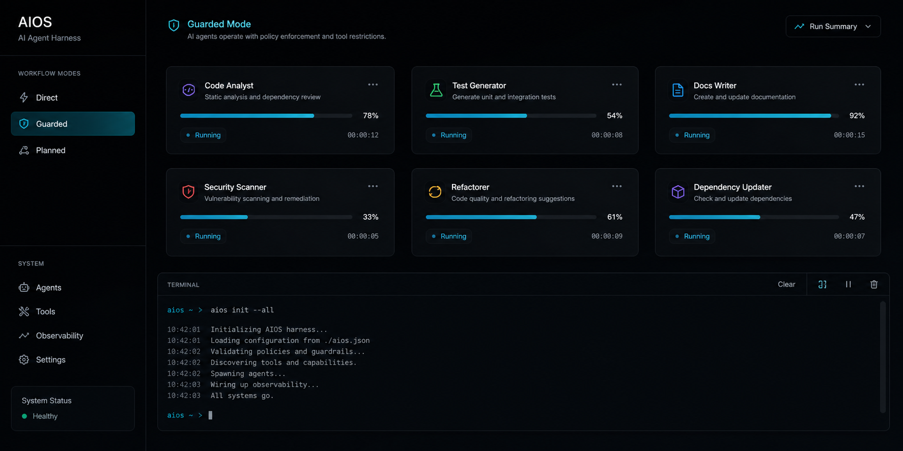
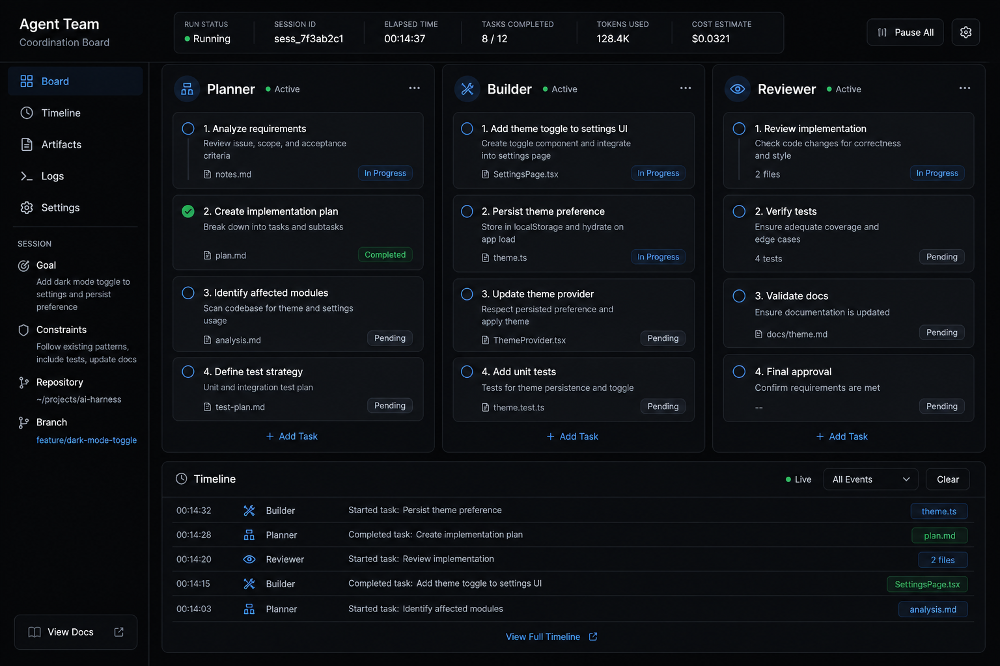
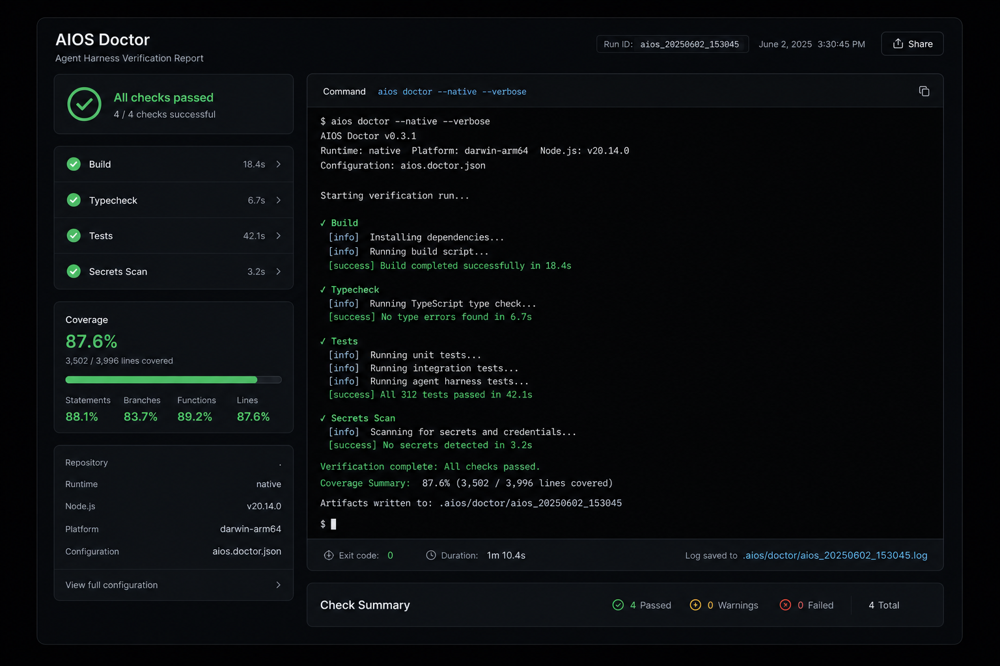

<!-- ============================================================
     Hero Section (v8 / ZIK3q) — 标题 + 人像图 + 通栏展示图
     ============================================================ -->

  

    

      

        <svg class="rex-hero__badge-icon" viewBox="0 0 24 24" fill="none" stroke="currentColor" stroke-width="1.8" aria-hidden="true"><path d="m12 3 1.6 5.4L19 10l-5.4 1.6L12 17l-1.6-5.4L5 10l5.4-1.6z"/><path d="m19 15 .8 2.2L22 18l-2.2.8L19 21l-.8-2.2L16 18l2.2-.8z"/></svg>
        一句话，搞定任何任务 · v{{ aios_version }}
      

      <h1 class="rex-hero__title">一句话，搞定任何复杂任务。</h1>

      

        告诉你的 AI 编码助手你要什么——就一句话。AIOS 是一个本地优先的 Graph Engine，它把记忆、验证和多 Agent 协作编排成可验证的 Agent 图，让它真正完成任务。支持 Claude Code、Codex、Gemini、OpenCode、Hermes、Grok——你不需要改变任何工作方式。
      

      

        <a href="getting-started" class="md-button md-button--primary">30 秒安装</a>
        <a href="https://github.com/rexleimo/aios" class="md-button">查看 GitHub</a>
      

      

        <code class="rex-hero__install-cmd" id="hero-install-cmd">curl -fsSL https://github.com/rexleimo/aios/releases/latest/download/aios-install.sh | bash</code>
        <button class="rex-hero__install-copy" type="button" data-copy-target="hero-install-cmd">复制</button>
      

      
    

    <figure class="rex-hero__portrait">
      
    </figure>
  

  <figure class="rex-hero__showcase">
    
  </figure>

<!-- ============================================================
     Logo 墙 — 客户端名
     ============================================================ -->

  兼容你已使用的客户端
  

    codex
    claude
    gemini
    opencode
    hermes
    grok
  

<!-- ============================================================
     Team 特性带 — 图左文右
     ============================================================ -->

  <figure class="rex-band__media">
    
  </figure>
  

    多 AGENT 团队
    <h2 class="rex-band__title">说一句话，多个 Agent 并行搞定</h2>
    

      你只需说一句话，AIOS 自动把工作拆分给多个 Agent 并行执行。
      独立任务并行跑，耦合改动保持顺序——你只管等结果。
    

    <a class="rex-band__link" href="team-ops">看看怎么实现的 →</a>
  

<!-- ============================================================
     Verification 特性带 — 文左图右
     ============================================================ -->

  

    验证 / 隐私
    <h2 class="rex-band__title">先自查，再给你看</h2>
    

      AIOS 对每次改动运行自诊断、安全检查和验证循环——
      你看到的是能用的结果，不是需要修的半成品。你的代码和数据永不离开本机。
    

    <a class="rex-band__link" href="troubleshooting">了解验证机制 →</a>
  

  <figure class="rex-band__media">
    
  </figure>

<!-- ============================================================
     Run 层 2×2
     ============================================================ -->

  

    工作原理
    <h2 class="rex-run__title">一句话，触发四个系统</h2>
    
记忆、路由、协作与安全——在幕后默默为你工作。

  

  

    <article class="rex-run__card">
      <h3 class="rex-run__card-title">记住一切</h3>
      
你的项目决策、约束和进度保存在本地。下次会话，Agent 从上次停下的地方继续——不用重新解释。

      <code class="rex-run__card-cmd">aios init</code>
    </article>
    <article class="rex-run__card">
      <h3 class="rex-run__card-title">选对方法</h3>
      
AIOS 自动为你的任务选最简单的路径——快速回答、谨慎编辑、还是完整计划——你不用想流程。

      <code class="rex-run__card-cmd">aios work</code>
    </article>
    <article class="rex-run__card">
      <h3 class="rex-run__card-title">自动拆分工作</h3>
      
任务有独立部分时，AIOS 用多个 Agent 并行跑——你只需说一次你要什么。

      <code class="rex-run__card-cmd">aios team</code>
    </article>
    <article class="rex-run__card">
      <h3 class="rex-run__card-title">交付前检查</h3>
      
每次改动都运行安全检查和验证循环。你拿到的是能用的结果，不是要返工的半成品。

      <code class="rex-run__card-cmd">aios verify</code>
    </article>
  

<!-- ============================================================
     全宽安装块
     ============================================================ -->

  

    <h2 class="rex-install__title">30 秒，开始你的第一个一句话任务</h2>
    
安装、初始化项目，然后直接告诉 Agent 你要什么。

    

      <code class="rex-install__cmd">aios init --all</code>
      <code class="rex-install__cmd">aios doctor --native --verbose</code>
    

    <a href="getting-started" class="md-button md-button--primary rex-install__cta">免费开始 →</a>
  

<!-- ============================================================
     博客列表（3 条）
     ============================================================ -->

  

    来自博客
    <h2 class="rex-bloglist__title">最新工作流指南</h2>
    <a class="rex-bloglist__more" href="https://cli.rexai.top/blog/">全部文章 →</a>
  

  

    <article class="rex-bloglist__card">
      Graph Engine
      <h3 class="rex-bloglist__card-title"><a href="/blog/zh/2026-08-10-aios-loop-graph-engineering/">Graph Engine 本地实现</a></h3>
      
把 loop 工具箱与图节点组合成可验证的 Agent 图，数据始终留在本机。

    </article>
    <article class="rex-bloglist__card">
      团队
      <h3 class="rex-bloglist__card-title"><a href="/blog/zh/2026-08-parallel-coding-agents/">并行编码 Agent</a></h3>
      
独立工作项何时可以并行——以及何时绝不能。

    </article>
    <article class="rex-bloglist__card">
      工作流
      <h3 class="rex-bloglist__card-title"><a href="/blog/zh/2026-07-v400-adaptive-workflow-policy/">4.0.0 自适应工作流策略</a></h3>
      
先分类工作，再选择流程控制——noop、direct、guarded、planned。

    </article>
  

<!-- ============================================================
     收尾 CTA
     ============================================================ -->

  

    <h2 class="rex-cta__title">不想再反复解释了？开始吧。</h2>
    
一句话就够了。装好 AIOS，让 Agent 搞定剩下的事。

    

      <a href="getting-started" class="md-button md-button--primary">免费开始</a>
      <a href="contextdb" class="md-button">阅读文档</a>
    

  

