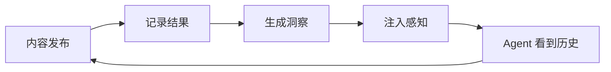

# Perception 感知层

> 让 agent 从内容运营结果中学习 —— 什么有效、什么无效、为什么。

感知闭环弥合了"agent 做了什么"和"agent 知道结果怎样"之间的差距。它记录结构化的内容结果快照，按维度生成统计洞察，并将感知摘要注入 agent 上下文，让未来的决策有数据支撑。

## 工作原理



1. **记录** — 内容发布后，记录指标（点赞、收藏、评论、浏览）和上下文（话题、格式、发布时间）
2. **分析** — 按维度分组结果，计算统计量，判断置信度
3. **注入** — 构建感知摘要，agent 下次运行时自动看到

## 快速开始

### 记录结果

```bash
aios perception record \
  --content-id "note_abc123" \
  --platform xiaohongshu \
  --content-type note \
  --title "10个提升效率的AI工具" \
  --metrics '{"likes":150,"comments":23,"saves":45,"views":2000}' \
  --context '{"topic":"AI工具","format":"图文","publishHour":20}'
```

### 生成洞察

记录多条结果后（每组维度至少 3 条）：

```bash
aios perception insights --min-sample 3
```

输出示例：

```
从 5 条结果中生成了 3 条洞察。
  [insight] topic=AI工具 avgLikes=123 avgSaves=53 confidence=low sampleSize=3
  [insight] format=图文 avgLikes=157 avgSaves=45 confidence=low sampleSize=4
  [insight] publishHour=20 avgLikes=123 avgSaves=53 confidence=low sampleSize=3
```

### 查看感知摘要

```bash
aios perception summary
```

```bash
# JSON 格式输出
aios perception summary --format json
```

## 感知摘要格式

agent 启动新会话时，会看到类似这样的摘要：

```markdown
## Perception Layer

### Performance Summary
- Content Published: 12
- Avg Engagement: 238
- Trend: improving (+18%)
- Best Recent: "10个AI工具" (engagement=380)

### Recent Outcomes
- [24h] "10个AI工具" likes=150 saves=45 comments=23
- [24h] "恋爱日常" likes=200 saves=30 comments=45

### Active Insights
- [topic:AI工具] avgLikes=150, confidence=high (n=8)
- [format:图文] avgSaves=45, confidence=medium (n=5)
- [publishHour:20] avgEngagement=280, confidence=low (n=3)

### Strategy Recommendations
- 优先话题 "AI工具"（互动最高）
- 优先格式 "图文"（收藏率最高）
- 在 20:00 左右发布（最佳时段）
```

## 分析维度

结果按以下上下文维度分组：

| 维度 | 说明 | 示例 |
|------|------|------|
| `topic` | 内容话题/分类 | "AI工具"、"恋爱"、"情绪" |
| `format` | 内容格式 | "图文"、"视频"、"vlog" |
| `publishHour` | 发布小时（0-23） | 20 |
| `publishDayOfWeek` | 发布星期 | "Monday" |
| `contentType` | 内容类型 | "note"、"video" |
| `coverStyle` | 封面风格 | "minimal"、"illustration" |

## 置信度

洞察置信度基于样本量：

| 等级 | 样本量 | 含义 |
|------|--------|------|
| high | n >= 8 | 可靠信号 |
| medium | n >= 5 | 有希望的模式 |
| low | n >= 3 | 早期迹象 |
| insufficient | n < 3 | 数据不足 |

## 指标

可追踪的标准指标：

- `likes` — 点赞数
- `comments` — 评论数
- `saves` — 收藏数
- `shares` — 分享数
- `views` — 浏览量
- `impressions` — 曝光量
- `clickThroughRate` — 点击率
- `watchTime` — 观看时长
- `followerGain` — 涨粉数

## Agent 上下文注入

感知摘要由 `ctx-agent` 在构建 memory prelude 时自动注入 agent 上下文。触发条件：

- `CTXDB_PERCEPTION=true`（默认开启）
- 工作区存在感知数据

agent 会在上下文中看到感知摘要，与 persona、user profile、workspace memo 并列。

## 环境变量

| 变量 | 默认值 | 说明 |
|------|--------|------|
| `CTXDB_PERCEPTION` | `true` | 开关感知层注入 |
| `PERCEPTION_MAX_CHARS` | `3000` | 感知层最大字符数 |
| `PERCEPTION_OUTCOMES_LIMIT` | `20` | 加载最近结果数 |
| `PERCEPTION_INSIGHTS_LIMIT` | `10` | 加载洞察 memo 数 |
| `PERCEPTION_MIN_SAMPLE` | `3` | 洞察生成最小样本量 |

## CLI 参考

```bash
# 记录结果
aios perception record --content-id <id> --platform <name> --content-type <type> [options]

# 生成洞察
aios perception insights [--min-sample <n>] [--dry-run]

# 查看摘要
aios perception summary [--format text|json] [--max-chars <n>]
```

### record 选项

| 选项 | 必填 | 说明 |
|------|------|------|
| `--content-id` | 是 | 内容标识符 |
| `--platform` | 是 | 平台名称（如 xiaohongshu） |
| `--content-type` | 是 | 内容类型（如 note、video） |
| `--title` | 否 | 内容标题 |
| `--publish-time` | 否 | ISO 时间戳 |
| `--snapshot-window` | 否 | 指标快照窗口（默认：immediate） |
| `--metrics` | 否 | JSON 指标对象 |
| `--context` | 否 | JSON 上下文对象 |
| `--json` | 否 | JSON 格式输出 |

### insights 选项

| 选项 | 默认值 | 说明 |
|------|--------|------|
| `--min-sample` | 3 | 每组维度最小结果数 |
| `--dry-run` | false | 预览模式，不存储洞察 |

### summary 选项

| 选项 | 默认值 | 说明 |
|------|--------|------|
| `--format` | text | 输出格式：text 或 json |
| `--max-chars` | 10000 | 最大输出字符数 |
| `--space` | default | 工作区内存空间 |
