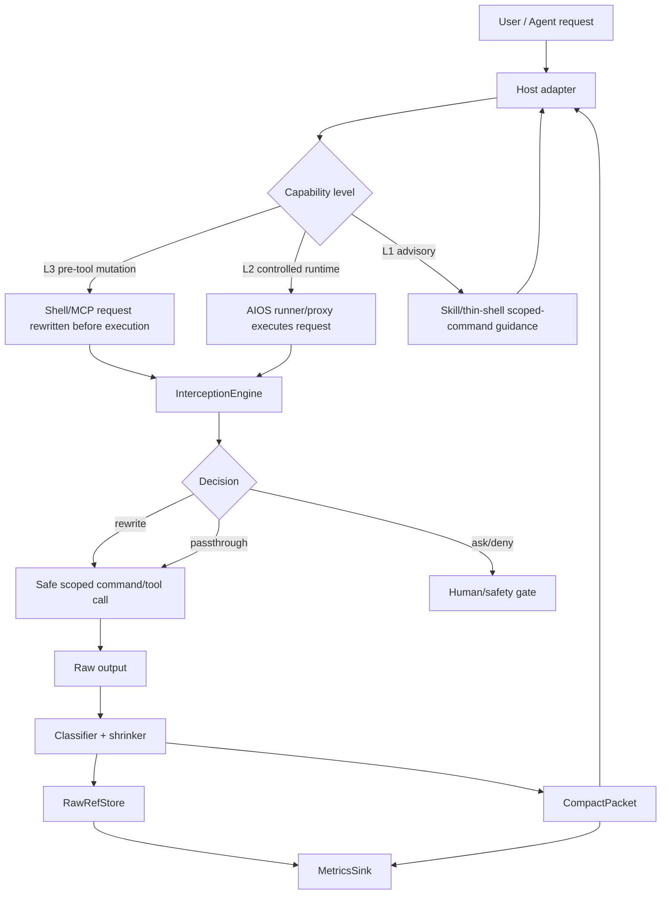

# AIOS Interception Runtime Architecture Plan

<!-- 中文注释：本计划记录 RTK/Caveman 复刻的数据面设计，强调可验证链路而不是 prompt-only 方案。 -->

Date: 2026-05-23
Status: replacement plan after post-refactor review
Scope: RTK/Caveman-style mechanism replication without installing or depending on RTK, Caveman, shell hooks, or competitor CLIs

## Why this replaces the old plan

The current refactor improved AIOS architecture, but it still does not provide RTK/Caveman mechanism parity.

What exists now:
- Client capability registry is centralized under `scripts/lib/clients/`.
- Native surfaces are generated from `client-sources/native-base/` to Codex, Claude, Gemini, and OpenCode surfaces.
- Skill sources are canonical under `skill-sources/` and synchronized through `config/skills-sync-manifest.json`.
- ContextDB can compact historical context with token strategies.
- Offload can store large tool output after the tool event and recall it through refs/canvas.
- Compression skills describe prompt-level input/output discipline.

What is missing:
- No deterministic boundary that intercepts current-turn shell or MCP output before it enters model context.
- No shared interception engine used by shell, MCP, harness, and client adapters.
- No compact packet contract that every adapter returns to the agent instead of raw output.
- No raw-ref store with hash, metadata, recall, redaction, TTL, and metrics as a first-class runtime surface.
- No client capability matrix that honestly distinguishes advisory behavior from transparent interception.

Therefore the old skill/context/offload-only plan is not enough. It remains useful as a control plane, but RTK/Caveman-style savings require a data plane.

## Definition of 1:1 mechanism parity

1:1 means replicating the mechanism contract, not copying code or installing competitors.

Required contract:
- Default interception: when a supported surface is enabled, the agent does not need to remember to save tokens.
- Pre-context filtering: large shell/MCP/browser outputs are filtered before becoming model-visible context.
- Output brevity: assistant-facing packets and harness reports are compact by default, with precise fallback when safety or ambiguity requires it.
- Raw recall: full raw output is still available by ref id, grep, and targeted read.
- Metrics: every shrink/offload decision records raw size, compact size, saved bytes, strategy, fallback reason, and ref id.
- Capability honesty: unsupported clients must report advisory/L1, not claim transparent/L3.

Non-goals:
- Do not install RTK, Caveman, shell hooks, or competitor CLIs.
- Do not claim raw Codex shell interception if Codex does not expose a pre-tool mutation surface.
- Do not hide errors, destructive-command risks, secrets, or verification gaps to save tokens.

## Control plane vs data plane

Control plane:
- Skills, native thin shells, workflow routing, Session Discipline, AAR, docs, doctor, sync checks.
- These tell the agent what should happen.
- They cannot prove current-turn token savings by themselves.

Data plane:
- Interception engine, shell gateway, MCP proxy, raw ref store, compact packet renderer, metrics sink, host adapters.
- These decide what actually enters the model-visible response.
- Only this layer can prove RTK-style pre-context savings.

## Target architecture



## New module tree

Create a focused runtime tree instead of scattering interception logic into existing skills/offload modules:

```text
scripts/lib/interception/
  index.mjs
  core/
    engine.mjs
    types.mjs
    capabilities.mjs
    decisions.mjs
    envelope.mjs
  packets/
    compact-packet.mjs
    packet-renderer.mjs
  refs/
    raw-ref-store.mjs
    recall.mjs
    redaction.mjs
  metrics/
    metrics-sink.mjs
    token-estimator.mjs
  shell/
    command-lexer.mjs
    command-registry.mjs
    shell-planner.mjs
    shell-wrapper.mjs
    filtered-runner.mjs
    output-shrinker.mjs
  mcp/
    stdio-proxy.mjs
    json-rpc-framer.mjs
    json-rpc-proxy.mjs
    tools-list-shrink.mjs
    tools-call-shrink.mjs
    result-classifier.mjs
  adapters/
    claude.mjs
    codex.mjs
    cursor.mjs
    gemini.mjs
    opencode.mjs
    harness.mjs
```

Entry scripts:

```text
scripts/aios-intercept.mjs
scripts/aios-mcp-proxy.mjs
scripts/hooks/claude/session-start.mjs
scripts/hooks/claude/user-prompt-submit.mjs
scripts/hooks/claude/pre-tool-use.mjs
```

Config/state:

```text
config/aios-interception.json
config/host-capabilities.json
.aios/interception/refs/<session>/
.aios/interception/metrics/<session>.jsonl
```

Existing `scripts/lib/offload/` remains as history/resume offload. New `scripts/lib/interception/` is current-turn runtime interception. Do not collapse them unless the contracts are unified through explicit adapters.

## Core contracts

`InterceptionRequest`:

```js
{
  kind: 'shell' | 'mcp.tools_list' | 'mcp.tools_call' | 'assistant.output',
  host: 'claude' | 'codex' | 'cursor' | 'gemini' | 'opencode' | 'aios-harness' | 'generic-mcp',
  sessionId,
  cwd,
  payload,
  capabilities,
  metadata
}
```

`InterceptionDecision`:

```js
{
  action: 'rewrite' | 'passthrough' | 'deny' | 'ask' | 'shrink' | 'store_ref',
  reason,
  rewrittenPayload,
  safety,
  strategy
}
```

`CompactPacket`:

```json
{
  "type": "aios.compact_packet",
  "version": 1,
  "source": "shell|mcp|browser|harness",
  "host": "claude|codex|cursor|gemini|opencode|aios-harness",
  "sessionId": "...",
  "summary": "...",
  "key_lines": [],
  "errors": [],
  "refs": [
    { "ref_id": "...", "kind": "raw", "sha256": "...", "bytes": 184230 }
  ],
  "metrics": {
    "raw_bytes": 184230,
    "compact_bytes": 1820,
    "saved_bytes": 182410,
    "saving_ratio": 0.9901,
    "strategy": "head-tail-error-paths"
  },
  "recall": [
    "node scripts/aios.mjs refs read <ref_id>",
    "node scripts/aios.mjs refs grep \"pattern\" --ref <ref_id>"
  ],
  "safety": {
    "redacted": false,
    "requires_human": false
  }
}
```

## Shell interception

Goal: shell commands and outputs enter the model as compact packets when the host supports mutation or controlled execution.

Implementation:
- Host hook/adapter wraps shell calls as an envelope:
  `node scripts/aios-intercept.mjs shell --envelope <base64url-json>`.
- Envelope prevents shell quoting/injection bugs.
- `command-lexer` parses command structure; avoid naive regex.
- `command-registry` classifies known commands and danger zones.
- `shell-planner` decides rewrite/pass/ask/deny.
- `filtered-runner` executes rewritten command when AIOS owns execution.
- `output-shrinker` preserves exit code, stderr, errors, file paths, line numbers, and latest state.
- `raw-ref-store` stores full raw output if output crosses threshold or strategy requests it.

Decision examples:
- Large `cat` or `Get-Content`: rewrite to targeted head/tail or summary plus raw ref.
- Large `git diff`: rewrite to `git diff --stat` plus targeted hunks and raw ref.
- `rg`: usually pass through, but shrink if result count/bytes is large.
- Destructive commands: ask/deny before execution, never hide risk behind compact mode.
- Unknown command: pass through but still shrink/ref large output after execution.

Codex limitation:
- If raw Codex host shell offers no pre-tool mutation equivalent, do not claim L3 for raw Codex shell.
- Codex can still get L2/L3-like behavior through AIOS-controlled harness commands and MCP proxy.

## MCP interception

Goal: every MCP client can route through AIOS proxy for deterministic list/call shrinking.

Implementation:
- `scripts/aios-mcp-proxy.mjs` is a stdio JSON-RPC proxy.
- Client talks to AIOS proxy; proxy talks to the real MCP server.
- Preserve JSON-RPC ids, order, errors, notifications, and capabilities.
- Shrink `tools/list` by default:
  - keep name, required params, destructive/safety notes, short description;
  - store full schema/catalog as raw ref;
  - return compact catalog only.
- Shrink `tools/call` results by classifier:
  - large text/logs: summary + key lines + raw ref;
  - HTML: title/main landmarks/actions + raw ref;
  - large JSON: schema/sample/top keys + raw ref;
  - base64/screenshot: metadata + image/file ref, not inline blob;
  - errors: preserve exact error text and stack head/tail.

This should be the first deterministic cross-client path because it does not depend on each client exposing shell hooks.

## RawRefStore

Store current-turn raw payloads separately from historical offload refs:

```text
.aios/interception/refs/<session>/<ref_id>.raw
.aios/interception/refs/<session>/<ref_id>.meta.json
```

Metadata fields:
- `ref_id`, `session_id`, `host`, `kind`, `source`, `tool`, `command`, `cwd`.
- `created_at`, `ttl_days`, `raw_bytes`, `sha256`.
- `redaction_status`, `contains_secret_signal`, `privacy_level`.
- `compact_packet_id`, `strategy`, `fallback_reason`.

Recall commands should be surfaced by CLI:
- `node scripts/aios.mjs refs read <ref_id>`
- `node scripts/aios.mjs refs grep "pattern" --ref <ref_id>`
- `node scripts/aios.mjs refs list --session <session>`
- `node scripts/aios.mjs refs prune --older-than 30d`

Existing `.aios/offload/refs` can be bridged later, but current-turn interception should keep a cleaner raw/meta split.

## Client capability matrix

Capability levels:
- L3 Full Transparent: host supports session/start prompt injection, user-prompt interception, pre-tool rewrite or equivalent, and MCP proxy.
- L2 Controlled Runtime: AIOS owns a runner/proxy path, but native host raw shell may bypass it.
- L1 Advisory: skills/thin-shell/scoped-command guidance only.
- L0 Unsupported: no reliable AIOS surface.

Matrix:

| Client | Shell | MCP | Skills/native | Honest target |
| --- | --- | --- | --- | --- |
| Claude Code | L3 if hooks installed | L2/L3 through proxy | deep | Best first L3 shell target |
| Codex CLI | L1/L2 raw shell depending host API | L2/L3 through proxy | deep | Do not claim raw shell L3 unless pre-tool mutation exists |
| Cursor | L1 until extension/hook verified | L2 through proxy if configurable | add native target | capability-detected, not assumed |
| Gemini CLI | L1 until hook verified | L2 through proxy if configurable | compatibility | capability-detected, not assumed |
| OpenCode | L2/L3 depending plugin/mutation API | L2/L3 through proxy | compatibility | investigate adapter support |
| AIOS harness | L3 | L3 | controlled | AIOS owns execution path |
| Generic MCP client | N/A | L2 | N/A | proxy-only deterministic savings |

Update `scripts/lib/clients/core/definitions.mjs` or a sibling capability file to include interception-specific capabilities, not just `skills/agents/superpowers/native/team/harness`.

Suggested new capabilities:
- `interception.mcpProxy`
- `interception.shellPreToolRewrite`
- `interception.controlledShellRunner`
- `interception.sessionStartInjection`
- `interception.userPromptCompression`
- `interception.outputPacket`

## Skill and native thin-shell updates

Use the user's Skill article as the control-plane standard:
- `SKILL.md` is a router, not an implementation dump.
- Use Always Read, Session Discipline, Task Routing, Known Gotchas.
- Add smoke tests for references and sync drift.
- Do not hand-edit generated roots; edit `skill-sources/` and run sync.

Required skill-source changes:
- `skill-sources/aios-compress/SKILL.md`: clarify Caveman boundary, output packet behavior, AAR fields, and no retroactive savings.
- `skill-sources/aios-browser-compress/SKILL.md`: rename conceptually from browser-only guidance to input packet discipline or add an `aios-interception-runtime` skill; include compact packet contract and pre-context filtering rules.
- `skill-sources/aios-offload-recall/SKILL.md`: distinguish current-turn interception refs from historical offload refs; document fallback when no canvas/ref exists.
- `skill-sources/aios-long-running-harness/SKILL.md`: require Session Discipline and checkpoint/offload evidence.
- `skill-sources/aios-project-system/SKILL.md`: state that generated roots come from `skill-sources`; do not manually edit generated skill roots.
- `skill-sources/contextdb-autopilot/SKILL.md`: add lifecycle: load handoff -> event -> checkpoint -> context:pack -> AAR.
- `skill-sources/verification-loop/SKILL.md`: add interception acceptance gates.

Native thin-shell changes:
- `client-sources/native-base/shared/partials/core-instructions.md`: add Quick Routing, Auto-Triggers, Red Flags, and capability honesty.
- `client-sources/native-base/codex/project/AGENTS.md`: Codex-specific limitation: raw shell may be advisory unless AIOS-controlled runner/proxy is used.
- `client-sources/native-base/claude/project/CLAUDE.md`: hook-backed L3 path and required hooks.
- `client-sources/native-base/gemini/project/AIOS.md`: compatibility mode and MCP proxy path.
- `client-sources/native-base/opencode/project/AIOS.md`: adapter/proxy capability path.
- Add Cursor native source only after choosing a real Cursor surface; do not invent a non-discoverable root.

## Implementation order

This is not an MVP scope reduction; it is dependency order for the full architecture.

1. Contracts and tests
   - Add core types, compact packet renderer, token estimator, metrics sink.
   - Add sentinel tests proving raw payload is absent from compact response but recoverable by ref.
2. RawRefStore
   - Write raw/meta files, hash them, recall by read/grep/list/prune, privacy/redaction metadata.
3. MCP proxy
   - Implement JSON-RPC stdio proxy, `tools/list` shrink, `tools/call` shrink.
   - Wire at least one existing MCP config path through proxy.
4. Shell gateway
   - Implement envelope, lexer, registry, planner, runner, shrinker.
   - First support AIOS harness controlled runtime; then host adapters.
5. Client adapters/capability registry
   - Extend registry with interception capabilities and doctor output.
   - Implement Claude hook adapter first if supported by local settings model.
   - Keep Codex raw shell honest unless host API supports pre-tool mutation.
6. Skills/native alignment
   - Update `skill-sources` and native source templates.
   - Run sync/check commands.
7. Quality gates
   - Add `aios doctor interception` or equivalent.
   - Add CI/script tests and negative grep for competitor install instructions.

## Acceptance tests

Unit tests:
- `command-lexer`: quotes, PowerShell syntax, pipes, `&&`, `;`, redirects, heredoc skip.
- `shell-planner`: large read, git diff, destructive ask/deny, unknown pass-through.
- `output-shrinker`: preserves exit code, stderr, errors, paths, line numbers.
- `raw-ref-store`: raw/meta writes, sha256, grep/read/prune.
- `compact-packet`: metrics and recall command rendering.
- `json-rpc-proxy`: id/order/error/capability preservation.
- `tools-list-shrink`: compact schema remains usable.
- `tools-call-shrink`: large text/HTML/JSON/base64/error classification.

Sentinel proof:
- Generate large payload containing `UNIQUE_RAW_PAYLOAD_SENTINEL`.
- Run through shell or MCP interception.
- Assert model-visible compact packet does not include raw sentinel body.
- Assert `refs read` can recover the sentinel from raw ref.
- This proves pre-context filtering, not PostToolUse offload.

Integration checks:
- `node --test scripts/tests/interception-*.test.mjs`
- `node scripts/check-skills-sync.mjs`
- `node scripts/check-native-sync.mjs`
- `npm run test:scripts`
- `cd mcp-server && npm run typecheck && npm run test && npm run build` if MCP/browser runtime changed.

Negative checks:
- No instructions to install RTK/Caveman/competitor CLIs.
- No claims that prompt-only skills provide current-turn token savings.
- No generated skill/native drift.

## Product acceptance

The user should see these outcomes:
- In supported paths, large outputs come back as compact packets with refs automatically.
- The agent can recall full output by ref only when needed.
- Metrics show how much was saved.
- Doctor reports which clients are L3/L2/L1 and why.
- Skills explain the behavior without pretending to implement it alone.
- Unsupported clients degrade honestly instead of being marketed as 1:1.

## Open risks

- Host hook APIs may not expose pre-tool mutation for every client.
- JSON-RPC proxy must be strict; breaking MCP protocol would be worse than no compression.
- PowerShell parsing is hard; initial lexer should be conservative and pass through unknown syntax.
- Raw refs may store sensitive data; redaction metadata and privacy commands are mandatory.
- Over-aggressive shrinking can hide the only useful error line; protected-line rules must be tested.
